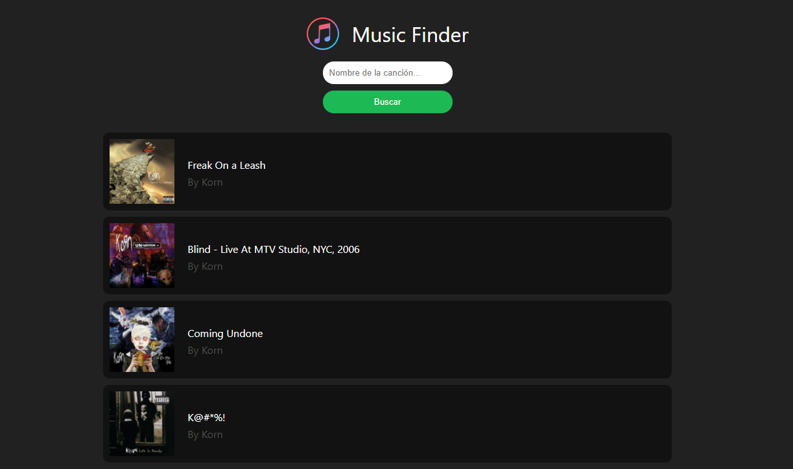

# Music Finder App

- Install dependencies

```console
$ npm install
```

- Run project

```console
$ npm run start
```

- Open Cypress panel

```console
$ npm run cypress:open
```

&nbsp;

This is a project made with React js and the Spotify API 🎶


